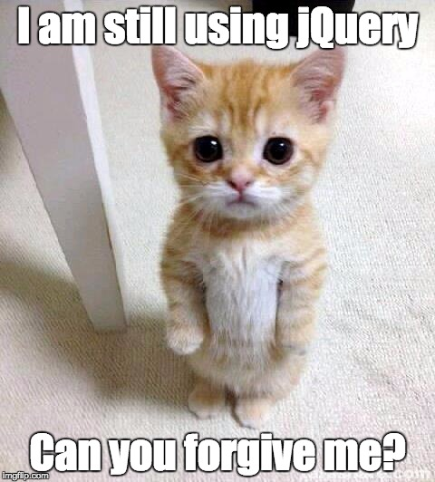

# 0x15-javascript-web_jquery

# General

* Why JQuery make front-end programming so easy (don’t forget to tweet today, with the hashtag #ilovejquery :))
* How to select HTML elements in JavaScript
* How to select HTML elements with JQuery
* What are differences between ID, class and tag name selectors
* How to modify an HTML element style
* How to get and update an HTML element content
* How to modify the DOM
* How to make a GET request with JQuery Ajax
* How to make a POST request with JQuery Ajax
* How to listen/bind to DOM event

# How to listen/bind to user events

# Requirements

* Allowed editors: vi, vim, emacs
* All your files will be interpreted on Chrome (version 57.0)
* All your files should end with a new line
* A README.md file, at the root of the folder of the project, is mandatory
* Your code should be semistandard compliant with the flag --global $: semistandard *.js --global $
* You must use JQuery version 3.x
* You are not allowed to use var
* HTML should not reload for each action: DOM manipulation, update values, fetch data…

# More Info

# Import JQuery

# src="https://code.jquery.com/jquery-3.2.1.min.js"

